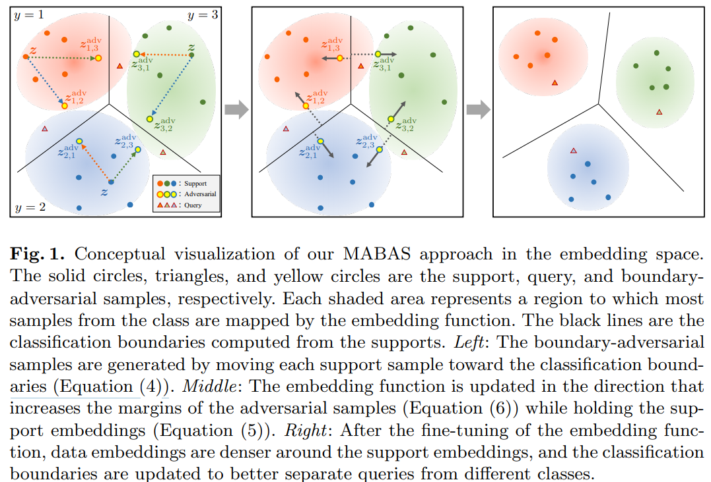

# Few-Shot Learning

A curated list of resources including papers, comparitive results on standard datasets and relevant links pertaining to few-shot learning.  

## Contributing

Contributions are welcome. If you have suggestions for new sections or valuable works to be included, please feel free to raise an issue and discuss in [issue](https://github.com/indussky8/awesome-few-shot-learning/issues) module.

## Table of Contents
+ [Papers](#Papers)
+ [Datasets](#Datasets)
+ [Starter code for FSL](#Starter-Code)
+ [Other Resources](#Other-resources)

## Few-Shot Learning (Classification)

### Papers

#### ECCV 2020 
+ **TF-vaegan**: Sanath Narayan\* , Akshita Gupta\* , Fahad Shahbaz Khan, Cees G. M. Snoek, Ling Shao. "Latent Embedding Feedback and Discriminative Features for Zero-Shot Classification." ECCV (2020). [[pdf]](https://arxiv.org/pdf/2003.07833.pdf) [[code]](https://github.com/akshitac8/tfvaegan).
+ **LsrGAN**: Maunil R Vyas, Hemanth Venkateswara, and Sethuraman Panchanathan. "Leveraging Seen and Unseen Semantic Relationships for Generative Zero-Shot Learning." ECCV (2020). [[pdf]](https://arxiv.org/pdf/2007.09549.pdf). 
+ Xingyu Chen, Xuguang Lan, Fuchun Sun, and Nanning Zheng. "A Boundary Based Out-of-Distribution Classifier for Generalized Zero-Shot Learning." ECCV (2020). [[pdf]](https://arxiv.org/pdf/2008.04872.pdf).

+ **MABAS**: Jaekyeom Kim, Hyoungseok Kim, and Gunhee Kim. "Model-Agnostic Boundary-Adversarial Sampling for Test-Time Generalization in Few-Shot learning." ECCV (2020). [[pdf]](https://www.ecva.net/papers/eccv_2020/papers_ECCV/papers/123460579.pdf).

  

#### ICLR 2020
+ Tristan Sylvain, Linda Petrini, Devon Hjelm. "Locality and Compositionality in Zero-Shot Learning." ICLR (2020). [[pdf]](https://openreview.net/pdf?id=Hye_V0NKwr).

### Datasets
+ **LAD:** Large-scale Attribute Dataset. Categories:230. [[link]](https://github.com/PatrickZH/A-Large-scale-Attribute-Dataset-for-Zero-shot-Learning)
+ **CUB:** Caltech-UCSD Birds. Categories:200. [[link]](http://www.vision.caltech.edu/visipedia/CUB-200-2011.html)
+ **AWA2:** Animals with Attributes. Categories:50. [[link]](https://cvml.ist.ac.at/AwA2/)
+ **aPY:** attributes Pascal and Yahoo. Categories:32 [[link]](http://vision.cs.uiuc.edu/attributes/)
+ **Flowers Dataset:** There are two datasets, Categories: 17 and 102. [[link]](http://www.robots.ox.ac.uk/~vgg/data/flowers/)
+ **SUN:** Scene Attributes. Categories:717. [[link]](http://cs.brown.edu/~gmpatter/sunattributes.html)

### Starter Code
This repository contains a `Demo` folder which has a Jupyter Notebook step-by-step code to "An embarrassingly simple approach to zero-shot learning." ICML (2015).
This can be used as an introductory code to obtain the basic understanding of Zero-shot Learning.

## Other resources
+ https://medium.com/@alitech_2017/from-zero-to-hero-shaking-up-the-field-of-zero-shot-learning-c43208f71332
+ https://www.analyticsindiamag.com/what-is-zero-shot-learning/
+ https://medium.com/@cetinsamet/zero-shot-learning-53080995d45f
+ https://amitness.com/2020/05/zero-shot-text-classification/

## License

