# Few-Shot Learning

A curated list of resources including papers, comparitive results on standard datasets and relevant links pertaining to few-shot learning.  

## Contributing

Contributions are welcome. If you have suggestions for new sections or valuable works to be included, please feel free to raise an issue and discuss in [issue](https://github.com/indussky8/awesome-few-shot-learning/issues) module.

## Table of Contents
+ [Papers](#Papers)
+ [Datasets](#Datasets)
+ [Starter code for FSL](#Starter-Code)
+ [Other Resources](#Other-resources)

## Few-Shot Learning (Classification)

### Papers

#### ICLR 2021
+ **DC**: Shuo Yang, Lu Liu, and Min Xu. "Free Lunch for Few-shot Learning: Distribution Calibration." ICLR oral(2021). [[pdf]](https://openreview.net/pdf?id=JWOiYxMG92s) [[code]](https://github.com/ShuoYang-1998/ICLR2021-Oral_Distribution_Calibration).

  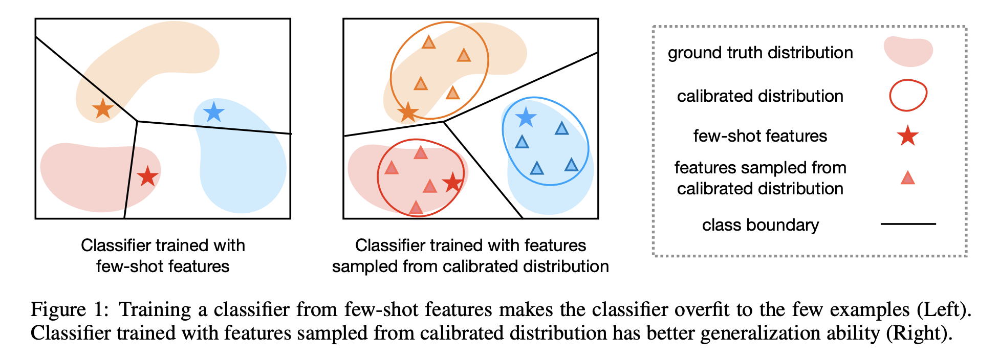
  
+ **STARTUP**: Cheng Perng Phoo, and Bharath Hariharan. "Self-training For Few-shot Transfer Across Extreme Task Differences." ICLR oral(2021). [[pdf]](https://openreview.net/pdf?id=O3Y56aqpChA).

  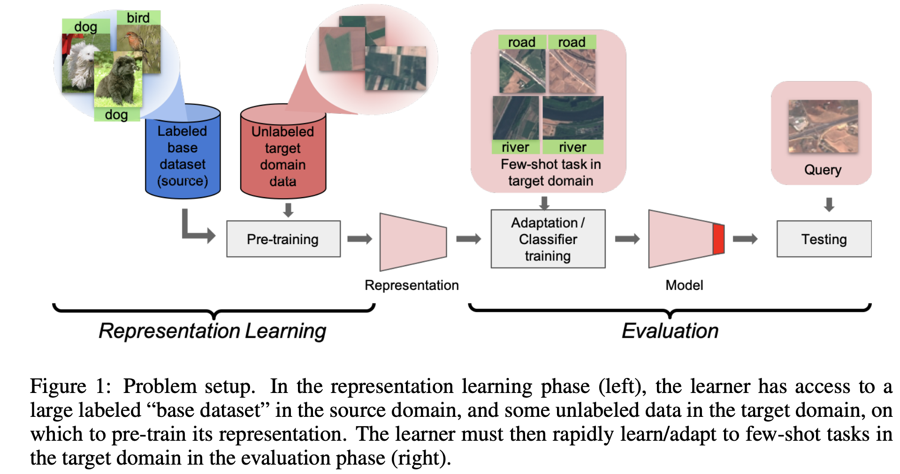
  
+ **CPM**: Mengye Ren, Michael Louis Iuzzolino, Michael Curtis Mozer, and Richard Zemel. "Wandering within a world: Online contextualized few-shot learning." ICLR(2021). [[pdf]](https://openreview.net/pdf?id=oZIvHV04XgC).
 
  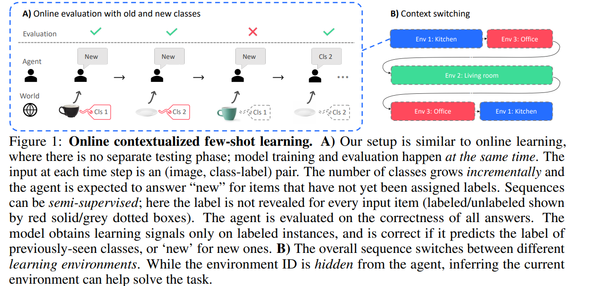
  
+ **THEORY**: Simon Shaolei Du, Wei Hu, Sham M. Kakade, Jason D. Lee, and Qi Lei. "Few-Shot Learning via Learning the Representation, Provably." ICLR(2021). [[pdf]](https://openreview.net/pdf?id=pW2Q2xLwIMD).
 
+ **URT**: Lu Liu, William L. Hamilton, Guodong Long, Jing Jiang, and Hugo Larochelle. "A Universal Representation Transformer Layer for Few-Shot Image Classification." ICLR(2021). [[pdf]](https://openreview.net/pdf?id=04cII6MumYV). <b>`<Meta-Dataset>`
 
  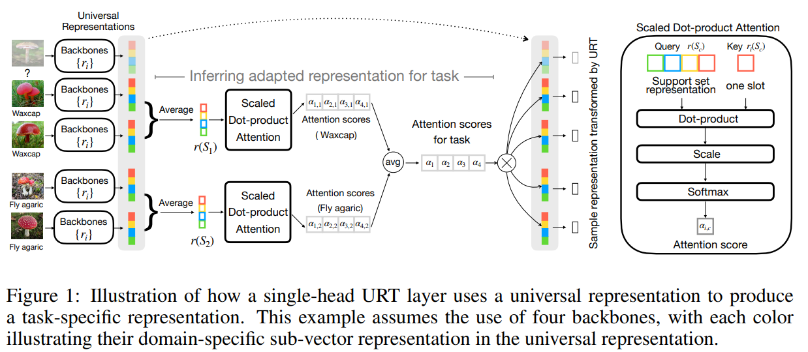
  
+ **COMET**: Kaidi Cao, Maria Brbic, and Jure Leskovec. "Concept Learners for Few-Shot Learning." ICLR(2021). [[pdf]](https://openreview.net/pdf?id=eJIJF3-LoZO).
 
  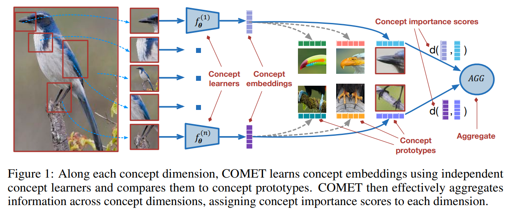
  
+ **IEPT**: Manli Zhang, Jianhong Zhang, Zhiwu Lu, Tao Xiang, Mingyu Ding, and Songfang Huang. "IEPT: Instance-Level and Episode-Level Pretext Tasks for Few-Shot Learning." ICLR(2021). [[pdf]](https://openreview.net/pdf?id=xzqLpqRzxLq).
 
  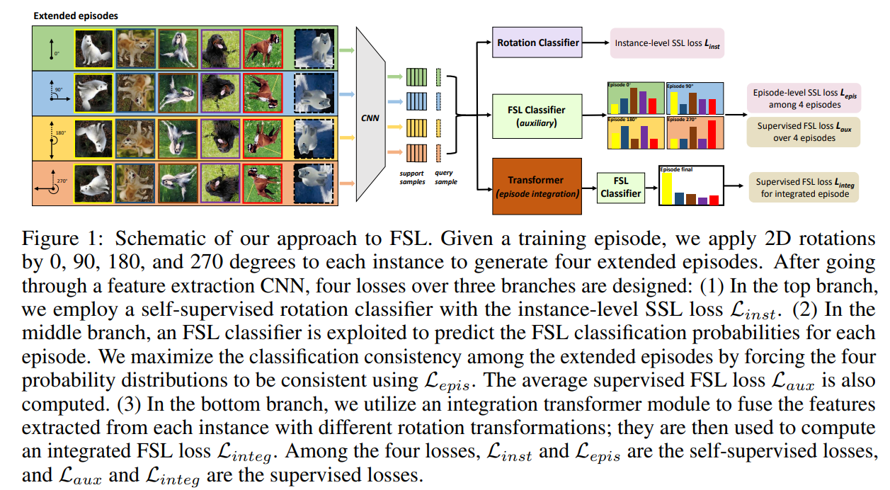
 
+ **IDLVQ-C**: Kuilin Chen, and Chi-Guhn Lee. "Incremental few-shot learning via vector quantization in deep embedded space." ICLR(2021). [[pdf]](https://openreview.net/pdf?id=3SV-ZePhnZM). <b>`<LVQ>`
  
+ **SLE**: Bingchen Liu, Yizhe Zhu, Kunpeng Song, and Ahmed Elgammal. "Towards Faster and Stabilized GAN Training for High-fidelity Few-shot Image Synthesis." ICLR(2021). [[pdf]](https://openreview.net/pdf?id=1Fqg133qRaI).
  
+ **repurposing MAML**: Namyeong Kwon, Hwidong Na, Gabriel Huang, and Simon Lacoste-Julien. "Repurposing Pretrained Models for Robust Out-of-domain Few-Shot Learning." ICLR(2021). [[pdf]](https://openreview.net/pdf?id=qkLMTphG5-h) [[code]](https://anonymous.4open.science/r/08ef52cf-456a-4e36-a408-04e1ad0bc5a9/).

  
  
+ **MELR**: Nanyi Fei, Zhiwu Lu, Tao Xiang, and Songfang Huang. "MELR: Meta-Learning via Modeling Episode-Level Relationships for Few-Shot Learning." ICLR(2021). [[pdf]](https://openreview.net/pdf?id=D3PcGLdMx0).

  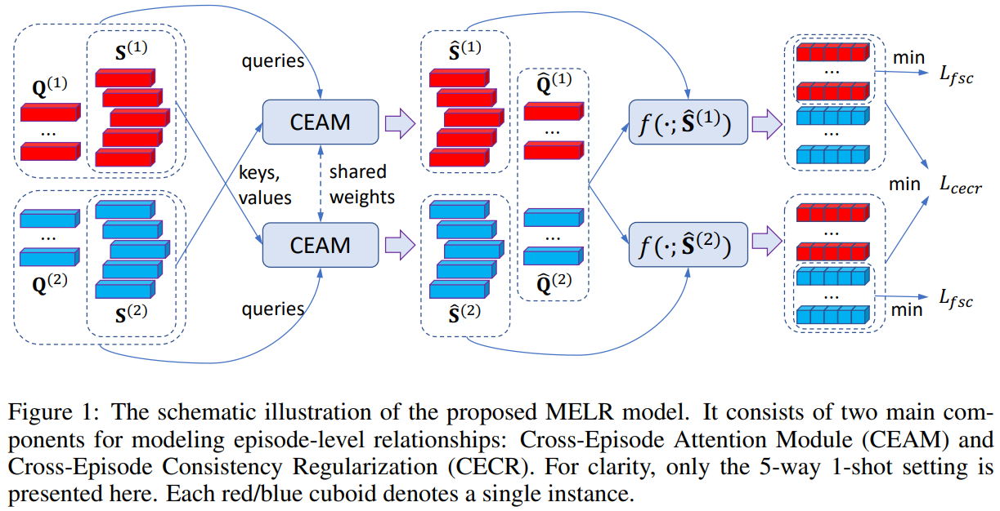
  
+ **MELR**: Namyeong Kwon, Hwidong Na, Gabriel Huang, and Simon Lacoste-Julien. "MELR: Meta-Learning via Modeling Episode-Level Relationships for Few-Shot Learning." ICLR(2021). [[pdf]](https://openreview.net/pdf?id=D3PcGLdMx0).

  
  
  
  

#### ECCV 2020 
+ **MABAS**: Jaekyeom Kim, Hyoungseok Kim, and Gunhee Kim. "Model-Agnostic Boundary-Adversarial Sampling for Test-Time Generalization in Few-Shot learning." ECCV (2020). [[pdf]](https://www.ecva.net/papers/eccv_2020/papers_ECCV/papers/123460579.pdf) [[code]](https://github.com/jaekyeom/MABAS).

  
  
+ **centroid alignment**: Arman Afrasiyabi, Jean-François Lalonde, and Christian Gagné. "Associative Alignment for Few-shot Image Classification." ECCV (2020). [[pdf]](https://www.ecva.net/papers/eccv_2020/papers_ECCV/papers/123500018.pdf) [[code]](https://lvsn.github.io/associative-alignment/).

   
   
+ **TAFSSL**: Moshe Lichtenstein, Prasanna Sattigeri, Rogerio Feris, Raja Giryes, and Leonid Karlinsky. "TAFSSL: Task-Adaptive Feature Sub-Space Learning for few-shot classification." ECCV (2020). [[pdf]](https://www.ecva.net/papers/eccv_2020/papers_ECCV/papers/123520511.pdf). <b>`<Semi-supervised>`<b>`<transductive>`

  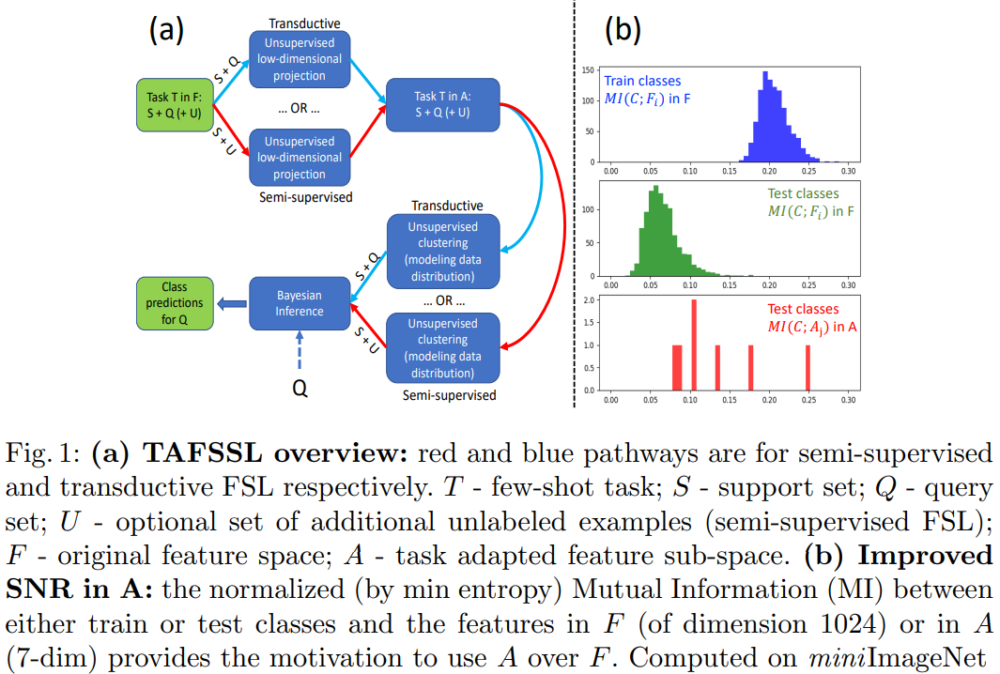 
  
+ **BD-CSPN**: Jinlu Liu, Liang Song, and Yongqiang Qin. "Prototype Rectification for Few-Shot Learning." ECCV (2020). [[pdf]](https://www.ecva.net/papers/eccv_2020/papers_ECCV/papers/123460715.pdf). <b>`<Meta-Dataset>`<b>`<transductive>`
  
   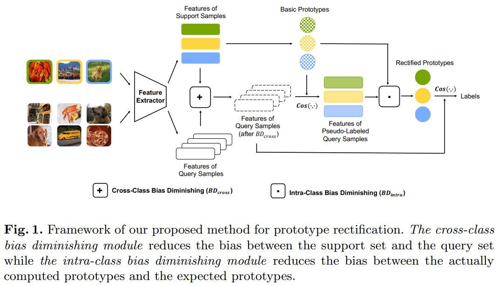
  
+ **SSL-FSL**: Jong-Chyi Su, Subhransu Maji, and Bharath Hariharan. "When Does Self-supervision Improve Few-shot Learning?." ECCV (2020). [[pdf]](https://www.ecva.net/papers/eccv_2020/papers_ECCV/papers/123520630.pdf). <b>`<self-supervised>`

  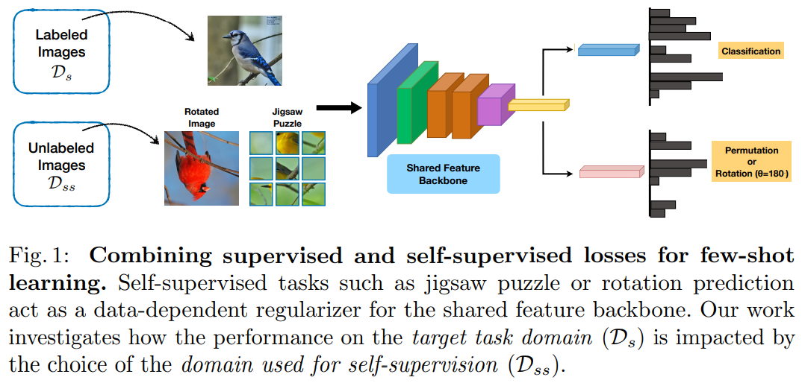
  
+ **IDA**: Qing Liu, Orchid Majumder, Alessandro Achille, Avinash Ravichandran, Rahul Bhotika, and Stefano Soatto. "Incremental Few-Shot Meta-Learning via Indirect Discriminant Alignment." ECCV (2020). [[pdf]](https://www.ecva.net/papers/eccv_2020/papers_ECCV/papers/123520664.pdf). <b>`<Incremental>`

  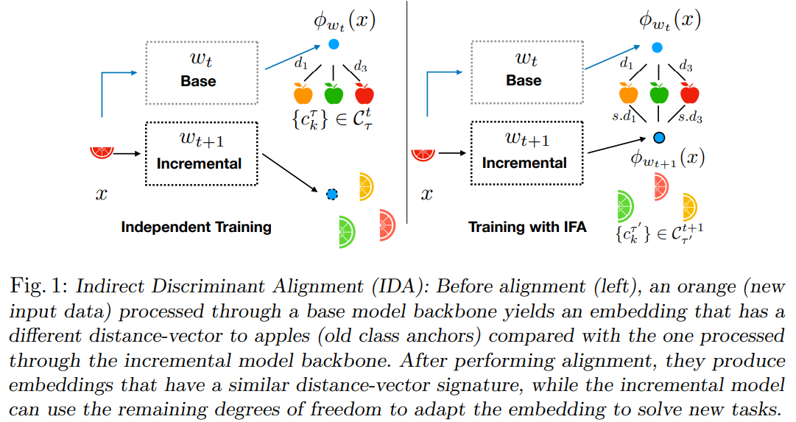
  
+ **LS-FSL**: Shuo Wang, Jun Yue, Jianzhuang Liu, Qi Tian, and Meng Wang. "Large-Scale Few-Shot Learning via Multi-Modal Knowledge Discovery." ECCV (2020). [[pdf]](https://www.ecva.net/papers/eccv_2020/papers_ECCV/papers/123550715.pdf).

  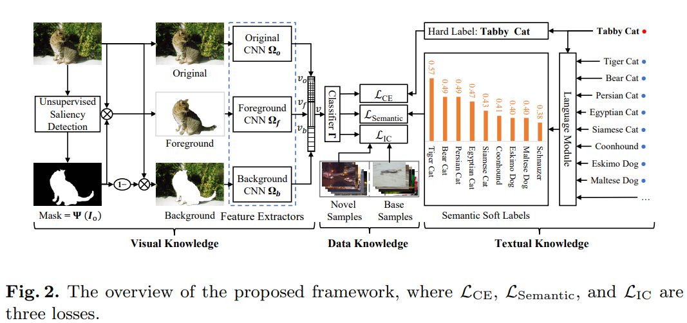

+ **SUR**: Nikita Dvornik, Cordelia Schmid, and Julien Mairal. "Selecting Relevant Features from a Multi-domain Representation for Few-shot Classification." ECCV (2020). [[pdf]](https://www.ecva.net/papers/eccv_2020/papers_ECCV/papers/123550766.pdf) [[code]](https://github.com/dvornikita/SUR). <b>`<Meta-Dataset>`

  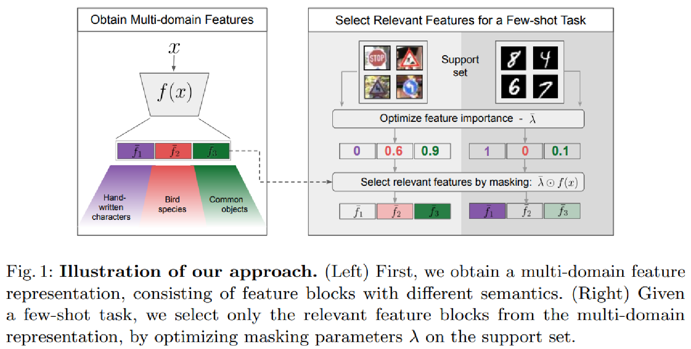

+ **LR-distill**: Yonglong Tian, Yue Wang, Dilip Krishnan, Joshua B. Tenenbaum, and Phillip Isola. "Rethinking Few-shot Image Classification: A Good Embedding is All You Need?." ECCV (2020). [[pdf]](https://www.ecva.net/papers/eccv_2020/papers_ECCV/papers/123590256.pdf) [[code]](https://github.com/WangYueFt/rfs/). <b>`<self-supervised>` <b>`<Meta-Dataset>`

  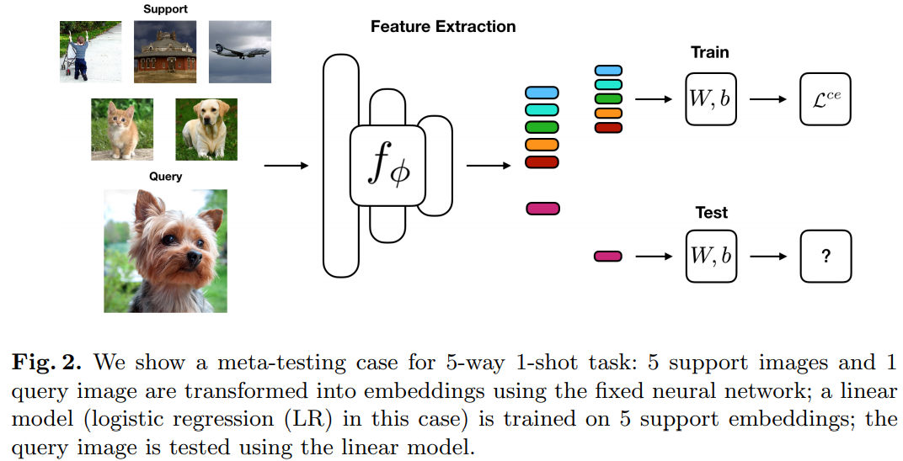
  
+ **E3BM**: Yaoyao Liu, Bernt Schiele, and Qianru Sun. "An Ensemble of Epoch-wise Empirical Bayes for Few-shot Learning." ECCV (2020). [[pdf]](https://www.ecva.net/papers/eccv_2020/papers_ECCV/papers/123610392.pdf) [[code]](https://gitlab.mpi-klsb.mpg.de/yaoyaoliu/e3bm). <b>`<transductive and inductive>`

  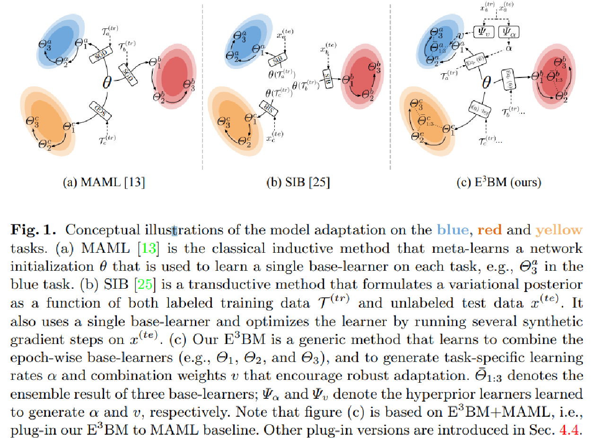
  
+ **Data Design**: Othman Sbai, Camille Couprie, and Mathieu Aubry. "Impact of base dataset design on few-shot image classification." ECCV (2020). [[pdf]](https://www.ecva.net/papers/eccv_2020/papers_ECCV/papers/123610579.pdf) [[code]](http://imagine.enpc.fr/~sbaio/publications/fewshot_dataset_design/index.html). <b>`<base training set selection>`

  
  
+ **SEN**: Van Nhan Nguyen, Sigurd Løkse, Kristoffer Wickstrøm, Michael Kampffmeyer, Davide Roverso, and Robert Jenssen. "SEN: A Novel Feature Normalization Dissimilarity Measure for Prototypical Few-Shot Learning Networks." ECCV (2020). [[pdf]](https://www.ecva.net/papers/eccv_2020/papers_ECCV/papers/123680120.pdf). 

  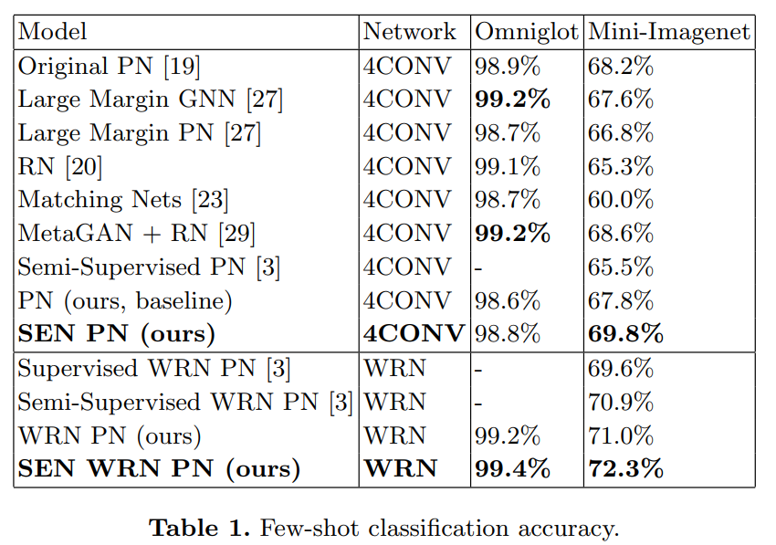
  
+ **EPNet**: Pau Rodríguez, Issam Laradji, Alexandre Drouin, and Alexandre Lacoste. "Embedding Propagation: Smoother Manifold for Few-Shot Classification." ECCV (2020). [[pdf]](https://www.ecva.net/papers/eccv_2020/papers_ECCV/papers/123710120.pdf) [[code]](https://github.com/ElementAI/embedding-propagation). <b>`<Semi-supervised>`<b>`<transductive>`

  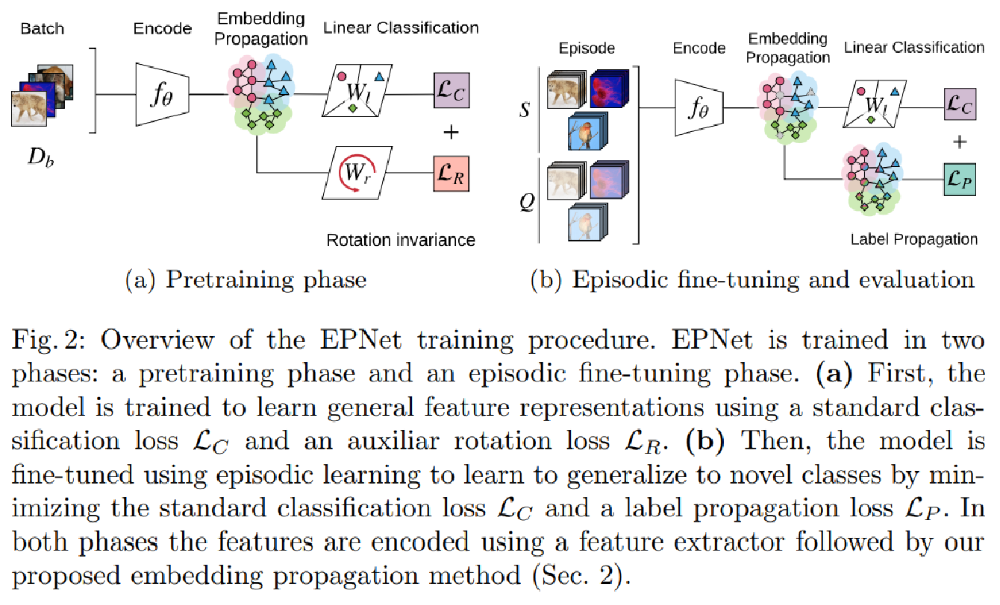
  
+ **BSCD-FSL**: Yunhui Guo, Noel C. Codella, Leonid Karlinsky, and James V. Codella, John R. Smith, Kate Saenko, Tajana Rosing, Rogerio Feris. "A Broader Study of Cross-Domain Few-Shot Learning." ECCV (2020). [[pdf]](https://www.ecva.net/papers/eccv_2020/papers_ECCV/papers/123720120.pdf) [[code]](https://github.com/IBM/cdfsl-benchmark). <b>`<transductive and inductive>`

  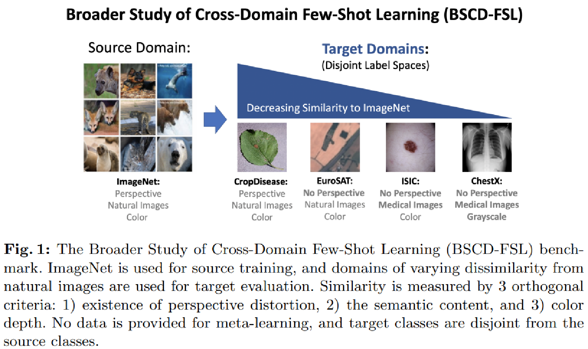
  
+ **DeepCaps-FSL**: Fangyu Wu, Jeremy S.Smith, Wenjin Lu, Chaoyi Pang, and Bailing Zhang. "Attentive Prototype Few-shot Learning with Capsule Network-based Embedding." ECCV (2020). [[pdf]](https://www.ecva.net/papers/eccv_2020/papers_ECCV/papers/123730239.pdf). <b>`<transductive>`

  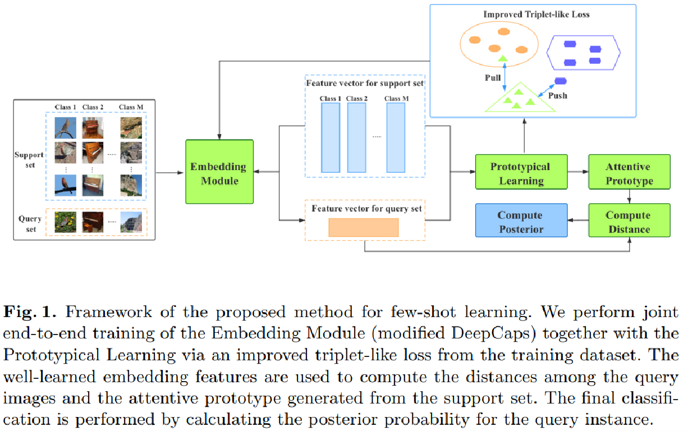
  
+ **Neg-Cosine**: Bin Liu, Yue Cao, Yutong Lin, Qi Li, Zheng Zhang, Mingsheng Long, and Han Hu. "Negative Margin Matters: Understanding Margin in Few-shot Classification." ECCV (2020). [[pdf]](https://www.ecva.net/papers/eccv_2020/papers_ECCV/papers/123490426.pdf) [[code]](https://github.com/bl0/negative-margin.few-shot.).

  
  

#### ICLR 2020
+ **ProtoNet-EST**: Tianshi Cao, Marc T Law, and Sanja Fidler. "A Theoretical Analysis of the Number of Shots in Few-Shot Learning." ICLR (2020). [[pdf]](https://openreview.net/attachment?id=HkgB2TNYPS&name=original_pdf).

+ **Transductive fine-tuning**: Guneet Singh Dhillon, Pratik Chaudhari, Avinash Ravichandran, and Stefano Soatto. "A Baseline for Few-Shot Image Classification." ICLR (2020). [[pdf]](https://openreview.net/attachment?id=rylXBkrYDS&name=original_pdf). <b>`<transductive>`

+ **LFT-FSL**: Hung-Yu Tseng, Hsin-Ying Lee, Jia-Bin Huang, and Ming-Hsuan Yang. "Cross-Domain Few-Shot Classification via Learned Feature-Wise Transformation." ICLR (2020). [[pdf]](https://openreview.net/pdf?id=SJl5Np4tPr) [[code]](https://github.com/hytseng0509/CrossDomainFewShot).

  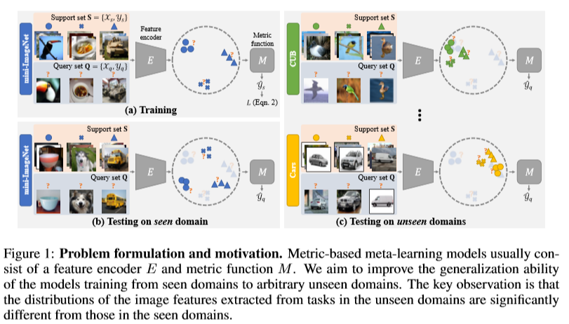
  
+ **Meta-Dataset**: Eleni Triantafillou, Tyler Zhu, Vincent Dumoulin, Pascal Lamblin, Utku Evci, Kelvin Xu, Ross Goroshin, Carles Gelada, Kevin Swersky, Pierre-Antoine Manzagol, and Hugo Larochelle. "Meta-Dataset: A Dataset of Datasets for Learning to Learn from Few Examples." ICLR (2020). [[pdf]](https://openreview.net/pdf?id=rkgAGAVKPr) [[code]](https://github.com/google-research/meta-dataset/tree/master/meta_dataset/dataset_conversion/splits).

+ **SIB**: Shell Xu Hu, Pablo Garcia Moreno, Yang Xiao, Xi Shen, Guillaume Obozinski, Neil Lawrence, and Andreas Damianou. "Empirical Bayes Transductive Meta-Learning with Synthetic Gradients." ICLR (2020). [[pdf]](https://openreview.net/pdf?id=Hkg-xgrYvH) [[code]](https://github.com/amzn/xfer). <b>`<transductive>`

  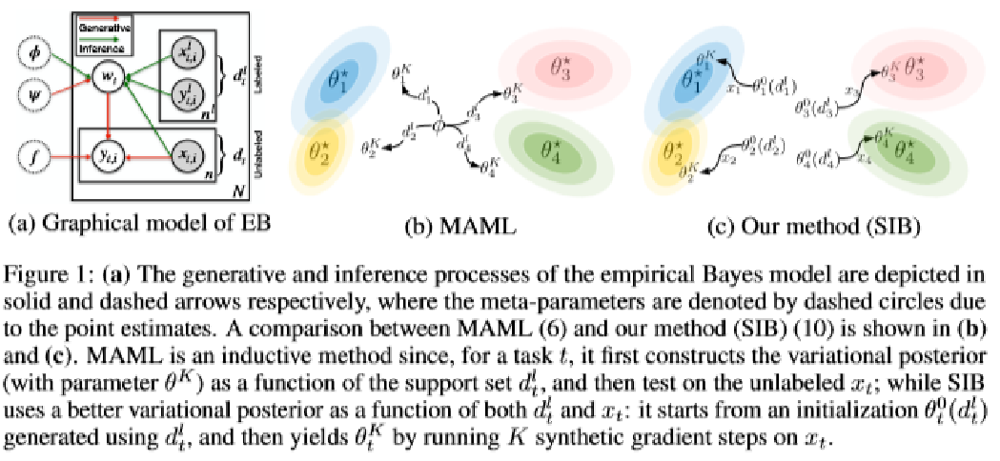
  

  
  
#### CVPR 2020

+ **Selection-FSL**: Linjun Zhou, Peng Cui, Xu Jia, Shiqiang Yang, and Qi Tian. "Learning to Select Base Classes for Few-Shot Classification." CVPR (2020). [[pdf]](https://openaccess.thecvf.com/content_CVPR_2020/papers/Zhou_Learning_to_Select_Base_Classes_for_Few-Shot_Classification_CVPR_2020_paper.pdf). <b>`<selection>`

+ **DSN**: Christian Simon, Piotr Koniusz, Richard Nock, and Mehrtash Harandi. "Adaptive Subspaces for Few-Shot Learning." CVPR (2020). [[pdf]](https://openaccess.thecvf.com/content_CVPR_2020/papers/Zhou_Learning_to_Select_Base_Classes_for_Few-Shot_Classification_CVPR_2020_paper.pdf) [[code]](https://github.com/chrysts/dsn_fewshot). <b>`<Semi-supervised>`<b>`<supervised>`

  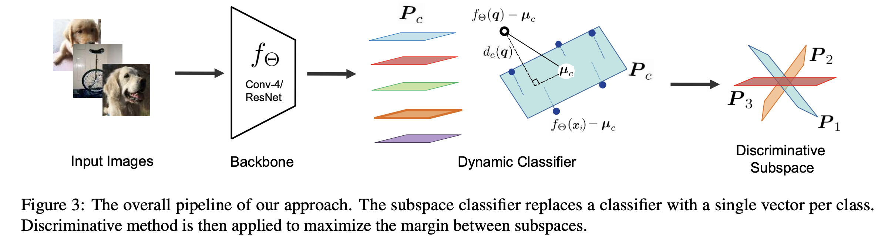
  
 
+ **Few-Shot Open-set**: Bo Liu, Hao Kang, Haoxiang Li, Gang Hua, and Nuno Vasconcelos. "Few-Shot Open-Set Recognition using Meta-Learning." CVPR (2020). [[pdf]](https://openaccess.thecvf.com/content_CVPR_2020/papers/Liu_Few-Shot_Open-Set_Recognition_Using_Meta-Learning_CVPR_2020_paper.pdf). <b>`<Weakly Supervised>`

  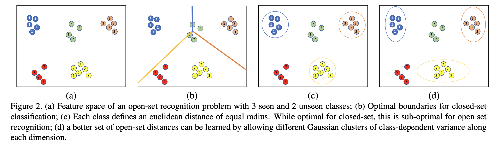
  
+ **FEAT**: Han-Jia Ye, Hexiang Hu, De-Chuan Zhan, and Fei Sha. "Few-Shot Learning via Embedding Adaptation with Set-to-Set Functions." CVPR (2020). [[pdf]](https://openaccess.thecvf.com/content_CVPR_2020/papers/Ye_Few-Shot_Learning_via_Embedding_Adaptation_With_Set-to-Set_Functions_CVPR_2020_paper.pdf) [[code]](https://github.com/Sha-Lab/FEAT). <b>`<Transformer>` <b>`<inductive+transductive>`

  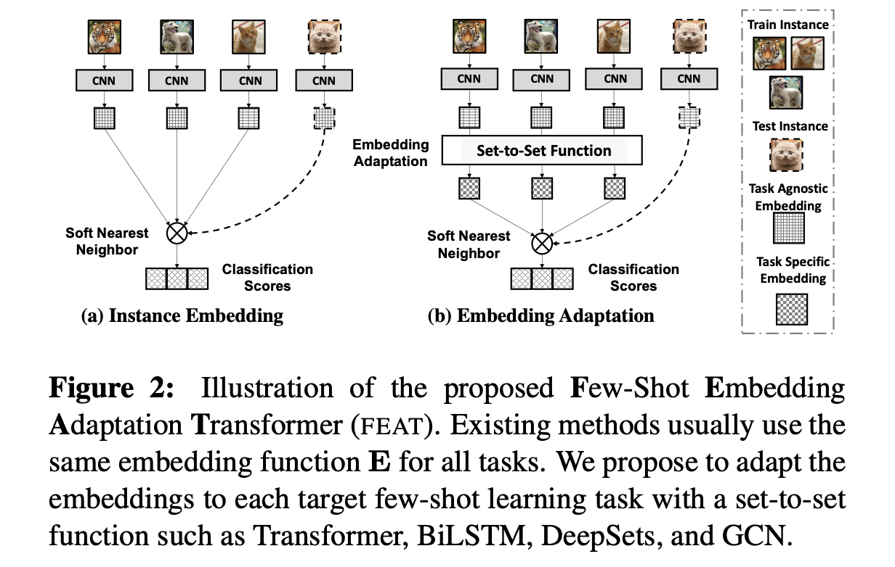
  
#### AAAI 2020

  
  
### Datasets
+ **miniImageNet:** [[link]](https://drive.google.com/file/d/1fJAK5WZTjerW7EWHHQAR9pRJVNg1T1Y7/view)
+ **tieredImageNet:** [[link]](https://github.com/kingfou/tieredImageNet)
+ **CUB:** [[link]](https://drive.google.com/file/d/1hbzc_P1FuxMkcabkgn9ZKinBwW683j45/view)
+ **Meta-Dataset:** [[link]](https://github.com/google-research/meta-dataset)
+ **CIFAR-FS:** [[link]](https://drive.google.com/file/d/1GjGMI0q3bgcpcB_CjI40fX54WgLPuTpS/view)
+ **FC100:** [[link]](https://drive.google.com/file/d/1_ZsLyqI487NRDQhwvI7rg86FK3YAZvz1/view)
# There are two datasets, Categories: 17 and 102. [[link]](http://www.robots.ox.ac.uk/~vgg/data/flowers/)

### Starter Code
There are several backbones: 
+ **Conv4:** [[link]](https://github.com/facebookresearch/fewshotDatasetDesign/blob/master/archs/Conv4_CL.py)
+ **Resnet10:** [[link]](https://github.com/facebookresearch/fewshotDatasetDesign/blob/a84094a0f6027d23be167295f59b5591b3eaef82/cl_fsl/io_utils.py)
+ **Resnet18:** [[link]](https://github.com/facebookresearch/fewshotDatasetDesign/blob/a84094a0f6027d23be167295f59b5591b3eaef82/cl_fsl/io_utils.py)
+ **WRN:** [[link]](https://github.com/facebookresearch/fewshotDatasetDesign/blob/master/archs/wide_resnet.py)

## Other resources
Please click [[here]](https://few-shot.yyliu.net/miniimagenet.html) for few-shot classification leaderboard.

## License

